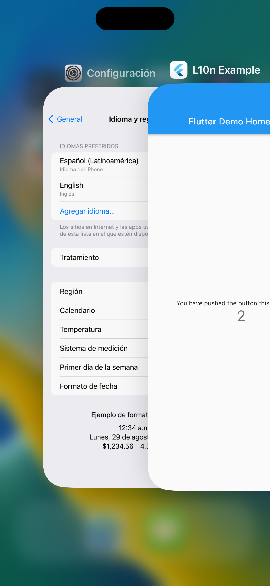

# Localization Example

Following the steps at https://docs.flutter.dev/development/accessibility-and-localization/internationalization#setting-up:

> Try switching the target platform’s locale to Spanish (es) and notice that the messages should be localized.

But the text remains in English. I'm expecting Flutter to provide some kind of automatic translation.

